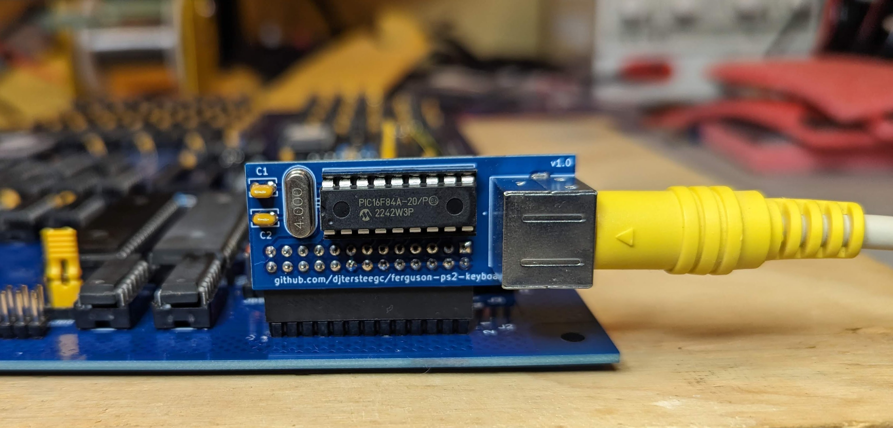

PS/2 to parallel keyboard adapter designed to plug into the 26 pin header of a Ferguson Big Board Z80 SBC. Based on the work shared by [enrico](https://forum.vcfed.org/index.php?members/enrico.5315/) here, https://forum.vcfed.org/index.php?threads/ferguson-big-board-1-monitor-rom.32705/#post-405189

### BOM

https://djtersteegc.github.io/ferguson-ps2-keyboard-adapter/ibom.html

### Firmware Flashing

Available in the [firmware](firmware) directory.  Use your favorite Pic programmer like a Pickit3 with an adapter board or a TL866/T48.

### Revisions

#### v1.0

Tested and working

#### v1.1 (Current)

Add a 100nf decoupling cap for the Pic chip.

